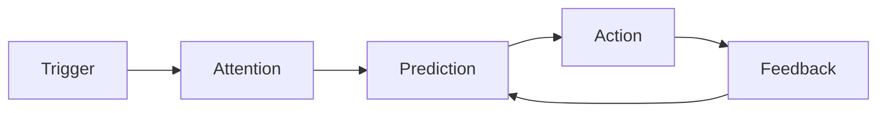

# Behavior School — Visual Systems Skill

## Purpose
Make psychology and behavioral science visually digestible.

## Visual stack
Use the strongest representation for the idea:
- Inline SVG for precise diagrams.
- Mermaid for conceptual maps and systems.
- SVG poster for the book hero/OG-style visual.
- Cards for discrete concepts.
- Timelines for processes.
- Loops for reinforcement/habit models.
- Matrices for trade-offs.
- Before/after frames for behavior change.
- Flowcharts for decision pathways.

## SVG poster contract
Every published book should have:
- 1200×1600 viewBox
- title
- author
- category
- one memorable metaphor
- 4–6 visual nodes
- one short behavioral formula
- readable typography
- no external image dependencies
- accessible `<title>` and `<desc>`

Keep poster files at:
`public/book-posters/<slug>.svg`

## Mermaid contract
Every book needs a book-specific concept graph. Prefer:
`flowchart LR`, `flowchart TD`, or `mindmap`.
Keep node labels short; explain nuance in prose around the diagram.

Example:

## Design rules
- Favor the existing Behavior School Claude/terracotta tokens.
- Never use decorative visuals that contradict the concept.
- Keep diagrams readable on mobile.
- Use captions to explain what the viewer should notice.
- Visuals must teach something; do not add “AI art” as empty decoration.
