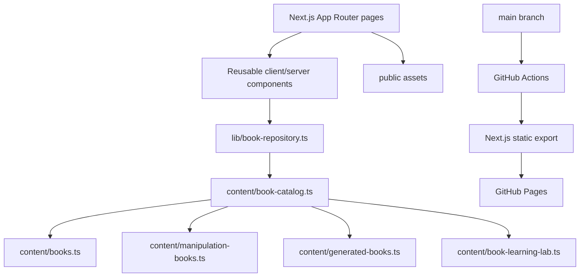

# Behavior School Architecture

## System map

## Core rule
Editorial data is separate from the UI. Pages consume structured data; they do not contain giant hard-coded book objects.

## Book resolution
`getBookBySlug(slug)` is the intended retrieval seam. If the repository later moves from TypeScript files to a CMS, database, or API, UI code should not need to change.

## Current book sources
- `content/books.ts`: 12 foundational books
- `content/manipulation-books.ts`: 12 manipulation/persuasion/defense books
- `content/generated-books.ts`: automated publishing output
- `content/book-learning-lab.ts`: reusable deep-learning data for existing books
- `content/book-catalog.ts`: composition and catalog metadata

## UI layers
- `BookLibrary.tsx`: browse/search/filter/sort/pagination
- `BookArtifacts.tsx`: visual models and field artifacts
- `BookLearningLab.tsx`: neuroscience lens, stories, field experiments and diagrams
- `MarkdownRenderer.tsx`: editorial deep-dive rendering
- Interactive tools: quizzes, polls, habit simulator, cognitive tester

## Static-export constraint
`next.config.ts` uses `output: "export"`.
That means every public route and asset must be buildable without a server runtime.

Avoid server-only APIs and runtime database queries in page rendering.
