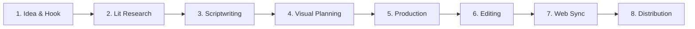

# ⚙️ Behavior School Content Production Pipeline

This document details the research standards, scriptwriting guidelines, visual design philosophy, and content creation pipeline for **Behavior School** media releases.

---

## 🔬 Research & Scientific Standards

Every piece of content created by Behavior School must strictly adhere to scientific rigor:

1. **Peer-Reviewed Scientific Foundations**: All claims regarding brain mechanisms, dopamine, memory, and cognitive biases must be backed by peer-reviewed literature (e.g., PubMed, Nature Neuroscience, Journal of Experimental Psychology).
2. **No Pseudoscientific Claims**: Avoid overhyped, unproven claims. Distinguish between correlation and causation.
3. **Plain English Translation**: Translate complex academic jargon into clear, relatable visual metaphors without sacrificing scientific accuracy.

---

## 🎬 8-Step Content Pipeline

### 1. Brainstorm & Hook Formulation
- Identify high-impact questions people face in daily life (e.g., *"Why do I overthink?"*, *"Why do I lose focus?"*).
- Formulate a clear, curiosity-inducing title and thumbnail hook.

### 2. Literature Research
- Gather scientific papers, books, and case studies.
- Document key neuro-psychological mechanisms and real-life case examples.

### 3. Scriptwriting & Storyboard
- **Structure**: Hook (0-30s) → Core Neuro-Psychological Cause → Case Study / Experiment → Actionable 3-Step Protocol → Key Summary.
- **Tone**: Empathetic, clear, research-backed, practical, engaging.

### 4. Visual Planning & Animation
- Plan visual diagrams for brain regions (Prefrontal Cortex, Amygdala, Basal Ganglia).
- Create custom infographics and step-by-step habit loops.

### 5. Production & Voiceover
- High-quality audio recording and deliberate pacing.

### 6. Editing & Polishing
- Cut out all fluff; maintain high information density per minute.

### 7. Web Platform Sync
- Add new video topics, diagnostic protocols, and mental models to the web repository on [behavior-school.github.io](https://behavior-school.github.io).

### 8. Distribution & Community
- Publish long-form video to YouTube [@behavior-school](https://www.youtube.com/@behavior-school).
- Release YouTube Shorts / Clips for key takeaways.

---

## 🗃️ Notion Database Architecture

Content databases are maintained in the official [Behavior School Notion Hub](https://app.notion.com/p/Behavior-School-373cd0ed0c25801e9a23c4ba60f032fb):

- 💡 **Video Ideas Database**: Backlog of candidate video topics & hooks.
- 📖 **Psychology & Neuroscience Terminology**: Glossary of cognitive biases and brain mechanisms.
- 🔬 **Research Papers & Books**: Curated literature references.
- 🎯 **Mental Models Library**: Frameworks cataloged by practical application category.
- 📝 **Script Vault**: Production scripts and storyboards.

---

For research submissions or video suggestions, check out <a href="CONTRIBUTING.md">CONTRIBUTING.md</a>.

