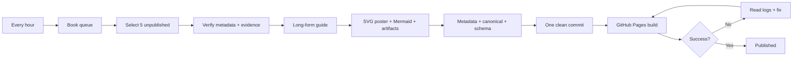

# Hourly Five-Book Publishing System

## Schedule
The publishing agent runs once per hour.

Each run:
1. reads the queue
2. checks the live catalog
3. selects 5 unpublished books
4. researches metadata
5. writes long-form original guides
6. creates Mermaid + SVG visual assets
7. updates the generated book collection
8. commits
9. verifies GitHub Actions
10. repairs build failures when needed

## Pipeline

## Failure handling
Never declare success merely because a commit exists.
The deployment must reach a successful workflow conclusion.

## Duplicate prevention
A slug is considered published if it exists in the composed book catalog.

## Batch size
Exactly five new books per successful run.

## Safety valves
If research metadata is uncertain, skip the candidate and select the next one.
If a generated page would be thin, do not publish it just to hit the batch count.
If a build fails, repair the failure before the next batch.
